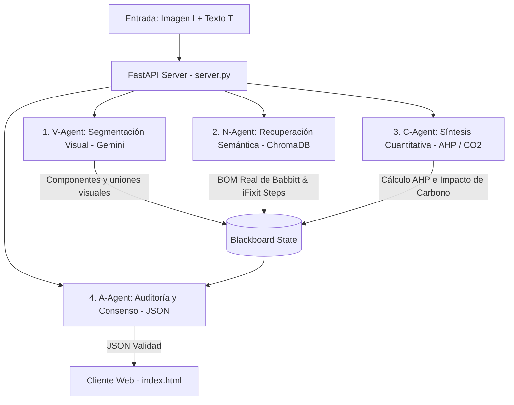

# 🔬 SADOC - Sistema de Agentes para el Diagnóstico de Obsolescencia y Ciclo de Vida

**SADOC** es una plataforma científica local de grado industrial diseñada para el **Análisis Forense de Durabilidad, Reparabilidad y Huella de Carbono** de productos electrónicos de consumo, enfocada en evaluar y predecir la duración de componentes críticos. 

El sistema utiliza una arquitectura **Multi-Agente Real (Process-Based Swarm)** construida sobre **FastAPI**, integrando consultas semánticas en tiempo real (**RAG**) contra una base de datos fusionada de **1,888 registros de componentes** (BOM de Babbitt et al., 2020) y **más de 11,000 manuales de reparación reales de iFixit**, evaluados bajo los estándares **ISO 14040/14067** y **EN 45554**.

---

## ⚡ Características Principales

1.  **Orquestación Multi-Agente:** Lógica distribuida en 4 agentes especializados (V-Agent, N-Agent, C-Agent, A-Agent) que debaten en un tablero compartido (*Blackboard*) para dirimir materiales y puntuaciones de reparabilidad.
2.  **Fusión Real de Datos Científicos (RAG):** Consulta local en una base de datos vectorial (**ChromaDB**) que fusiona masas de componentes de laboratorio y manuales de desmontaje de iFixit.
3.  **Buscador Científico de Base de Datos:** Pestaña interactiva en el frontend que permite buscar componentes o dispositivos específicos directamente en el RAG.
4.  **Cálculo Normativo Cuantitativo:**
    *   **EN 45554:** Puntuación de reparabilidad de 0 a 10 calculada mediante el Proceso de Jerarquía Analítica (AHP).
    *   **ISO 14067 (LCI):** Huella de carbono estimada multiplicando pesos en gramos de materiales reales por sus factores de emisión.
5.  **Análisis de Durabilidad:** Estimación de la vida útil individual de cada componente para diagnosticar debilidades críticas y predecir la obsolescencia programada.
6.  **Branding Premium:** Interfaz oscura adaptativa (*Glassmorphism*) con gráficos de barras interactivos (Chart.js) y exportación a informe PDF profesional (jsPDF).

---

## 🏗️ Arquitectura del Enjambre de Agentes

El flujo de análisis interactúa de la siguiente manera ante cada consulta:



---

## 🛠️ Requisitos de Instalación

Asegúrate de contar con Python 3.9+ instalado. Instala las dependencias necesarias:

```bash
pip install fastapi uvicorn google-generativeai chromadb sentence-transformers pandas openpyxl
```

---

## 🚀 Guía de Arranque Rápido

Para iniciar y probar la aplicación en tu entorno local:

### 1. Preparar la Base de Datos Fusionada
Ejecuta el script para realizar la fusión de datos (Babbitt BOM + iFixit Manuals) y compilar la base de datos vectorial local en ChromaDB:
```bash
python3 parse_real_babbitt.py
```

### 2. Configurar la API Key de Gemini
1. Copia el archivo de plantilla:
   ```bash
   cp config.local.example.js config.local.js
   ```
2. Edita `config.local.js` y agrega tu Gemini API Key en la variable `GEMINI_API_KEY`.

### 3. Iniciar el Servidor de Agentes (Backend)
Corre el servidor local de FastAPI en el puerto 8000:
```bash
python3 server.py
```

### 4. Iniciar la Interfaz Web (Frontend)
En una terminal secundaria, arranca el servidor HTTP en el puerto 8080 para evitar conflictos con el backend:
```bash
python3 -m http.server 8080
```

### 5. Probar
Abre tu navegador en `http://localhost:8080` y realiza:
*   Un análisis de producto multimodal en la pestaña de texto/imagen.
*   Una consulta semántica directa en la nueva pestaña de **Base de Datos**.

---

## 📜 Estándares Normativos Soportados

*   **EN 45554:** Métodos generales para la evaluación de la habilidad de reparación, reutilización y actualización de productos relacionados con la energía.
*   **ISO 14040 / 14044:** Gestión ambiental - Análisis de Ciclo de Vida (LCA) - Principios, marco y directrices.
*   **ISO 14067:** Huella de carbono de productos - Requisitos y directrices para cuantificación.

---

*Desarrollado bajo los estándares de arquitectura local de Antigravity Suite.* 🔬
